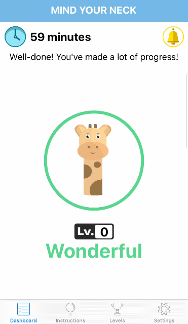
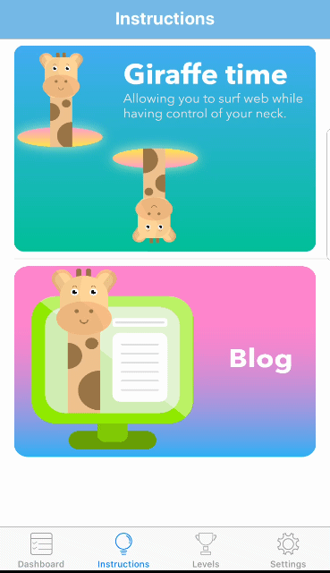
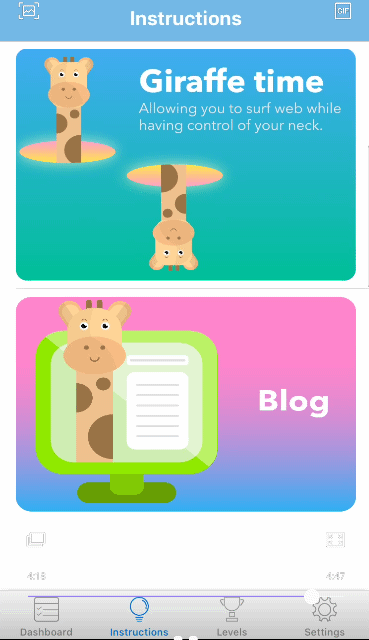

# Project Mind Your Neck
Project Mind Your Neck is a medical software project created to help prevent users from having negative symptoms such as neck pain, double chin, spinal degeneration under long screen usage

Website: 
http://mindyourneck.xyz/

Pitching video:
https://www.youtube.com/watch?v=6oNdBO62re8&t=2s

Demo video: 
https://drive.google.com/open?id=1ScnbrpPDWv-guLfx_vUhC1Vc964bPOO3

## Functions:
### 1. Coremotion based on phone's accelerometer:
- Detect phone's postions (good, almost, bad, relax-use phone while lying, flat-phone on table)
- Alarm users if they use their phone incorrectly 
- Delay notification by the bell button 

### 2. Giraffe Time: 
- Allow users to surf web while having control of their posture

### 3. Blog
- Update users with blogs about health, fitness, lifestye, etc.

### 4. Levels
- Get to know your posture's current level based on how much time you used your phone correctly

## Update:
This project is under construction for version 2.0 which has better posture detection through AI. Stay tuned!

## Instruction:
See the code in the "Mind Your Neck" folder (files with .swift)
